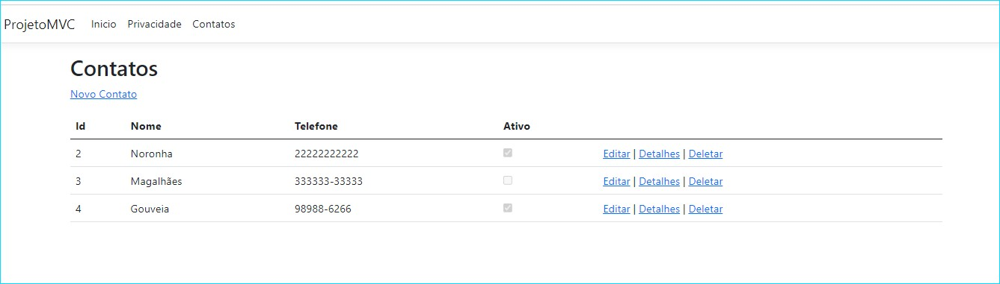
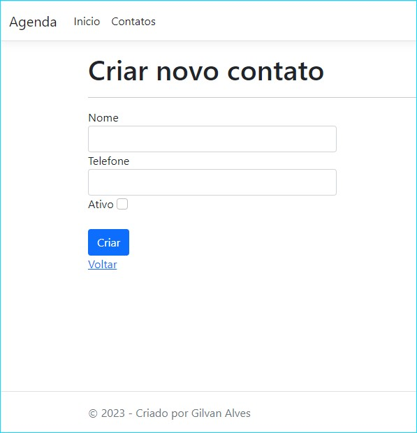
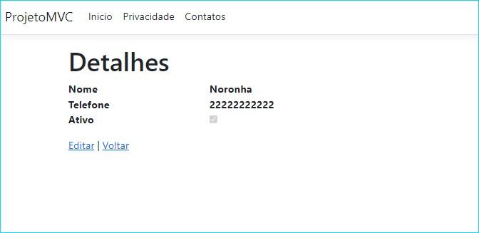
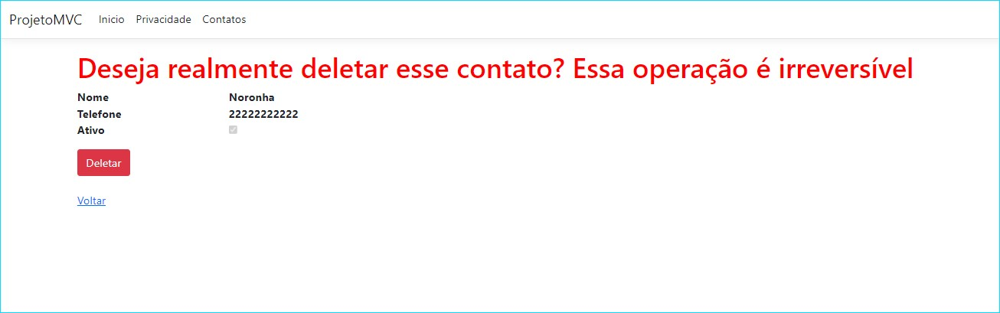

<h1 align="center">
   Schedule_Net 
</h1>

Sistema desenvolvido em arquitetura MVC para criar, visualizar, atualizar e/ou excluir contatos de uma agenda.   
Tecnologias utilizadas: Asp .NET MVC junto com Entity Framework e banco de dados SQL Server.   
Para executar o projeto, basta executar o seguinte comando no seu terminal:   
```
dotnet watch run   
```   
Ele possui:   

## Página de Contatos   

   
## Página de Edição     
   
## Página de visualização de detalhes do contato   
   
## Página de Exclusão de Contatos

